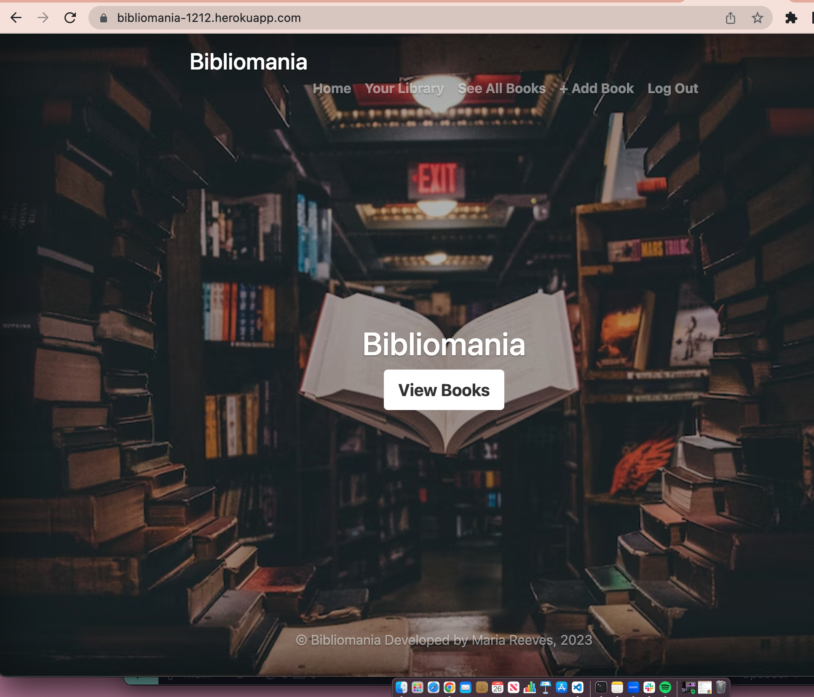
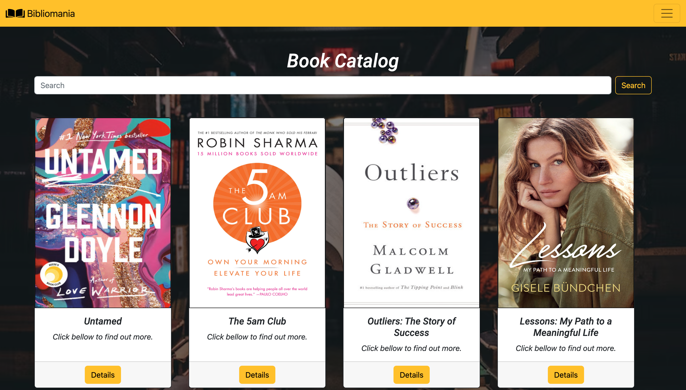

# Bibliomania 

## Overview: 

---

Welcome to your personal library!

Bibliomania is a crowdsourced app that allows users to easily add books to the book catalog. 

After books are added to the app, they are visible to all users. Users can then search for books, learn about new books and submit reviews.

---

## Screenshot(s):

---
## Technologies Used:

* NodeJs
* Express
* MondoDB
* Mongoose
* EJS
* CSS3
* Bootstrap

---
## Getting Started:

https://bibliomania-1212.herokuapp.com/

---

### Icebox:
* Have a "currently reading", "want to read" & "read" list attached to the User.
* Have an API to search for different books.
* Have a author Model
* Be able to search author and see what books are related to him.
* Be able to like or reply to other user's reviews. 
* Have a User Dashboard.
* Improve design.

---
### References:
* Starability: https://github.com/LunarLogic/starability
* Icons: https://www.flaticon.com/

